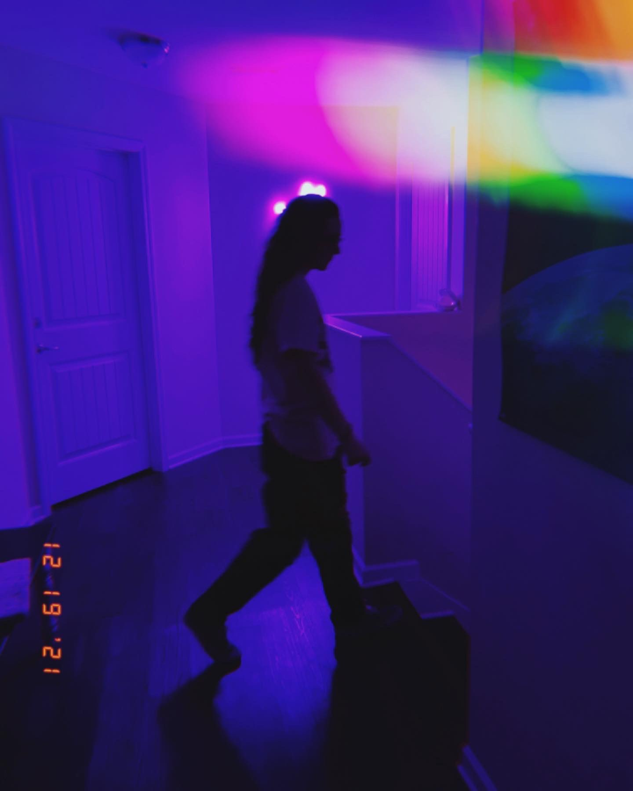

```yaml
 ______     __         __  __     ______     __     ______   __  __
/\  ___\   /\ \       /\_\_\_\   /\  == \   /\ \   /\__  _\ /\ \_\ \
\ \ \____  \ \ \____  \/_/\_\/_  \ \  __<   \ \ \  \/_/\ \/ \ \____ \
 \ \_____\  \ \_____\   /\_\/\_\  \ \_\ \_\  \ \_\    \ \_\  \/\_____\
  \/_____/   \/_____/   \/_/\/_/   \/_/ /_/   \/_/     \/_/   \/_____/

                - [🌐] https://mjanglin.com
                - [📧] contact@mjanglin.com


                                            tech & music enthusiast

info:
    - [📜] License: MIT
    - [📅] Last Updated: 2025-02-12
    - [🛠️] Version: 3.1.0
```

<div style="text-align:center;display:flex;justify-content:space-around;align-items:center;justify-self:stretch;">
     
    <h2> having fun while i learn  </h2>
</div>

 

---

#### GitHub

| Stats | Lang |
|:-------------------------:|:-------------------------:|
|  | [](https://github.com/clxrityy/github-readme-stats) |


---

#### Spotify

| Recently Played | Artist Profile | Personal Playlists |
|:-------------------------:|:-------------------------:| :-------------------------:|
| [](https://open.spotify.com/artist/0HaFO6TLXEZ2De3d67dThV) | <a target="_blank" href="https://open.spotify.com/artist/0HaFO6TLXEZ2De3d67dThV"></a> | [](https://open.spotify.com/user/mjanglin/playlists) |
