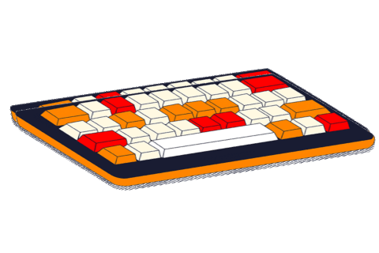

```yaml
 ______     __         __  __     ______     __     ______   __  __
/\  ___\   /\ \       /\_\_\_\   /\  == \   /\ \   /\__  _\ /\ \_\ \
\ \ \____  \ \ \____  \/_/\_\/_  \ \  __<   \ \ \  \/_/\ \/ \ \____ \
 \ \_____\  \ \_____\   /\_\/\_\  \ \_\ \_\  \ \_\    \ \_\  \/\_____\
  \/_____/   \/_____/   \/_/\/_/   \/_/ /_/   \/_/     \/_/   \/_____/

                - [🌐] https://www.mjanglin.com
                - [📧] contact@mjanglin.com

info:
    - [📜] License: MIT
    - [📅] Last Updated: 2025-02-12
    - [🛠️] Version: 3.1.0
```

### having fun while i learn 



---

[]

[](https://github.com/clxrityy/github-readme-stats)