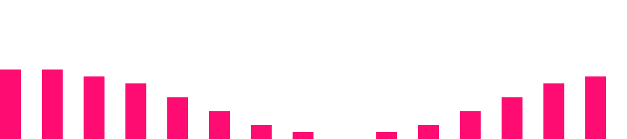

```yaml
//    ____ _    _  _ ____ _ ___ _   _
//    |    |     \/  |__/ |  |   \_/
//    |___ |___ _/\_ |  \ |  |    |

                                    README:
                                        - License: Apache 2.0
                                        - Last Updated: 2025-09-23
                                        - Version: 3.5.2
                                        - Site: https://mjanglin.com
                                        - Email: contact@mjanglin.com

 /      developer ⧉  |  producer ♫

```

<h2>
    code × audio × networks
    
    
</h2>

---

##### `@` Socials

[](https://www.linkedin.com/in/mjanglin1/) [](https://instagram.com/mjxnglin) [](https://discord.gg/kwYjW9AVAC) [](https://www.youtube.com/@clxrity_)

##### `♪` Music

[](https://open.spotify.com/artist/0HaFO6TLXEZ2De3d67dThV?trackId=7bcTsIZUFBLSX3sLI589wn) [](https://soundcloud.com/clxrityy) [](https://music.apple.com/us/artist/clxrity/1491234567)
